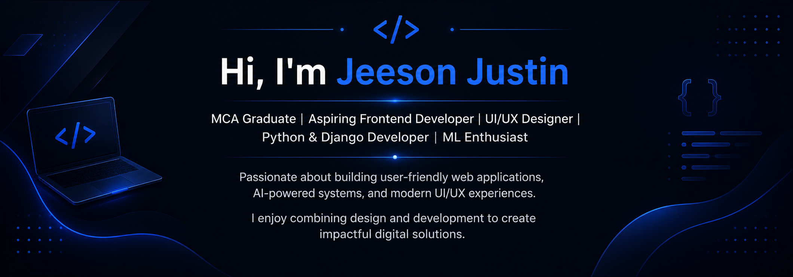

  

## Currently Learning

I am currently undergoing a 6-month Full Stack Development Internship, focusing on modern frontend and backend technologies used in industry.

### Frontend
- HTML
- Javascript
- Angular 20
- TypeScript
- Tailwind CSS
- Angular Signals
- RxJS

### Backend
- PHP 8
- Laravel 12
- MySQL / MariaDB
- Laravel Sanctum
- Stancl Tenancy
- Laratrust
- REST API Development

## Current Goal

Building strong frontend development skills with Angular while gaining practical experience in full-stack web application development.

## Featured Projects

### 🔹 AQI Prediction System

Machine Learning based AQI prediction dashboard using XGBoost and SHAP explainability with real-time AQI monitoring.

🔗 https://github.com/jeesonjustin/AQI-Prediction-System

---

### 🔹 AetherMap – Drone Flying Zone Tracker & Registration Portal

A full-stack Django-based drone registration and flight approval platform with interactive zone tracking and role-based access.

🔗 https://github.com/jeesonjustin/AetherMap-Drone-Registration

---

### 🔹 GetFly – Travel Booking App UI/UX

Modern travel booking mobile application UI/UX designed completely in Figma.

🔗 https://github.com/jeesonjustin/Travel-Booking-App-UIUX

---

### 🔹 Canvart – Art Selling Website

Frontend art-selling website developed using HTML, CSS, Bootstrap, and JavaScript.

🔗 https://github.com/jeesonjustin/Canvart-Artselling-Website

---

## Skills

* Python
* Django
* Flask
* Machine Learning
* XGBoost
* HTML
* CSS
* Bootstrap
* JavaScript
* UI/UX Design
* Figma
* Git & GitHub

---

## Connect With Me

* GitHub: [GitHub](https://github.com/jeesonjustin)
* LinkedIn: [LinkedIn](https://www.linkedin.com/in/jeesonjustin/)

---

Always learning and building new projects.

